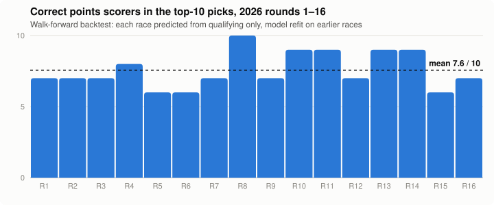
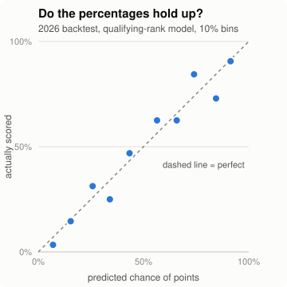
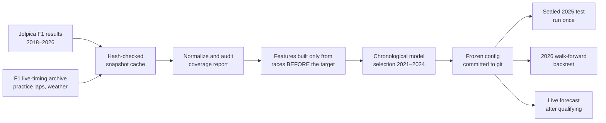

# 🏎️ F1 Points Predictor

[](https://github.com/reddynitish/f1-points-predictor/actions/workflows/ci.yml)


**After Saturday qualifying, this project estimates each driver's chance of scoring points in Sunday's Grand Prix.** For example: *Verstappen 92%, Bottas 6%.*

It's built like a production ML system. The data is cached and audited, a test suite checks for leakage, models are compared against honest baselines on races they've never seen, and every live forecast is saved before the race starts.

## Results at a glance

2026 season, rounds 1–16, from a **walk-forward backtest**. Each race was predicted using only information available when qualifying ended, with the model refit on earlier races only.

| | |
|---|---|
| Correct points scorers among the model's top-10 picks | **7.6 / 10 per race** (best: 10/10, worst: 6/10) |
| Drivers given an 80%+ chance who actually scored | **64 of 80 (80%)** |
| Error vs. knowing nothing (race-averaged Brier score) | **0.158 vs 0.248, 37% lower** |
| Did driver/team form beat qualifying position alone? | **No.** 0.161 vs 0.158, within noise; the same in the sealed 2025 test |

<picture>
  <source media="(prefers-color-scheme: dark)" srcset="docs/img/backtest-hits-dark.svg">
  
</picture>

<picture>
  <source media="(prefers-color-scheme: dark)" srcset="docs/img/calibration-dark.svg">
  
</picture>

> These numbers come from a retrospective backtest run in October 2026, not from forecasts published before each race. Live, archived forecasts will start with the 2026 Singapore Grand Prix (round 17). Full write-up: [2026 backtest](reports/BACKTEST_2026.md) · [model card](reports/MODEL_CARD.md).

## Live 2026 scorecard

Forecasts saved after qualifying and committed **before** each race, then scored automatically once results are published ([how it works](#live-forecasts)).

<!-- live-scorecard:start -->
_No live forecast has been scored yet. Forecasts are saved after qualifying and committed before each race; the first is the 2026 Singapore Grand Prix._
<!-- live-scorecard:end -->

## How it works



1. **Collect.** Every race result and qualifying session since 2018 comes from free public sources. Every download is stored with its source URL, retrieval time and SHA-256 hash, so the whole dataset can be rebuilt offline.
2. **Build features without cheating.** For each driver it uses qualifying position, form over their last 5 races, their team's form over its last 5 races, and the track. A feature for a race only ever uses races that happened *before* it, and tests prove that changing a race's result can't change that race's inputs.
3. **Pick a model fairly.** Baselines (a constant guess, and qualifying position alone) are compared with logistic regression and gradient boosting on whole seasons the model never trained on. The winner is frozen and committed *before* the test season is opened.
4. **Test once, report honestly.** The 2025 season was scored once. The fuller model didn't beat the qualifying-only baseline, so the baseline is the primary forecast. That finding is the result, not something hidden.

### Guardrails against leakage

- Race results, finishing status, race weather and pit strategy are on a forbidden-input list that's checked on every build.
- Team form is pooled across teammates per *whole prior event*, so a teammate's result from the same race can't leak in.
- Splits keep every race intact and move forward in time; there's no random row shuffling.
- Post-qualifying disqualifications are handled through a [sourced override file](overrides/qualifying.csv), not guesswork.
- `predict` refuses to run until qualifying is published, and never overwrites a saved forecast.

## Try it

```sh
make install                       # locked Python 3.12 environment via uv
make check                         # format, lint, type-check and the test suite (same as CI)

uv run python -m f1_points.cli collect --start 2018 --end 2026   # download and audit data
uv run python -m f1_points.cli build-dataset                     # leakage-safe features
uv run python -m f1_points.cli backtest --season 2026            # replay this season
uv run python -m f1_points.cli predict --season 2026 --round 17  # after qualifying
```

## Live forecasts

A [scheduled GitHub Action](.github/workflows/live.yml) runs every two hours from Friday to Monday (UTC):

1. Once at least an hour has passed since the scheduled qualifying start, and qualifying results are published, it saves a forecast to `predictions/<race>-prospective.json` and commits it. The git timestamp proves it came before the race.
2. After the race, it scores every saved forecast against the published results and updates the scorecard above.
3. Saved forecasts are never overwritten. A forecast is only counted as live if it was made before the race started.

## In progress

- **v2 features** ([pre-registered](docs/PREREGISTRATION_V2.md)): qualifying lap-time gap, practice pace from sessions held before qualifying, and weather observed during qualifying. A separate "just before the race" model also uses the official starting grid. They'll be tested once on 2026 and reported whether they help or not.
- **Dashboard**: a local page showing each race's predictions next to what actually happened.

## Project map

| Path | What's there |
|---|---|
| `src/f1_points/` | data adapters, features, models, backtest, CLI |
| `tests/` | synthetic fixtures, including leakage and refusal tests |
| `reports/` | data audit, model card, experiment results, backtest |
| `predictions/` | archived forecasts (`prospective`) and replays |
| `docs/` | master plan, research notes, data-gate decisions, pre-registration |

## Data and disclaimer

Data comes from the [Jolpica F1 API](https://github.com/jolpica/jolpica-f1) and F1's unofficial live-timing archive, accessed with [FastF1](https://github.com/theOehrly/Fast-F1) for schedule paths. Raw data is cached locally and never committed. Everything runs locally on a CPU, with no paid APIs.

This is an independent educational project, not affiliated with Formula 1, the FIA, teams or drivers. The probabilities are not certainties, and nothing here is betting advice.
